<!-- Header — animated typing SVG -->

 

  
  
  

---

I'm a <strong>Computer Science undergraduate at SLIIT, Sri Lanka</strong> with a passion for building things that actually work in production —
not just on localhost. I spend most of my time designing <strong>secure backend APIs</strong>, shipping <strong>full-stack web and mobile apps</strong>,
and automating everything with <strong>Docker, GitHub Actions, and Azure</strong>.

Beyond typical undergraduate work, I've built a <strong>custom compiler and DSL</strong>, implemented <strong>Raft consensus</strong> from scratch,
and integrated <strong>on-device AI</strong> into mobile apps. I write clean, tested, deployable code —
and I'm always learning something new, currently diving deep into <strong>Transformer architecture and deep learning</strong>.

📍 Kandy / Colombo, Sri Lanka &nbsp;·&nbsp;
🌐 <a href="https://ravidu.online">ravidu.online</a> &nbsp;·&nbsp;
✉️ <a href="mailto:raviduravisarad@gmail.com">raviduravisarad@gmail.com</a>

---

## 🛠️ Tech Stack

<!-- Row 1 — Languages, Backend, Frontend -->

  
  
  
  
  
  
  
  
  
  
  
  
  
  
  
  
  
  

<!-- Row 2 — DevOps, Cloud, Databases, ML, Tools -->

  
  
  
  
  
  
  
  
  
  
  
  
  
  
  
  
  
  

---

## 🚀 Featured Projects

<table>
  <tr>
    <td width="50%">
      <h3>🏥 HEALIX — Hospital Management System</h3>
      
Production-grade hospital platform with 3 role-based dashboards, 79 REST endpoints, JWT auth, RBAC, 102 xUnit tests, and full Azure CI/CD deployment.

      

        
        
        
        
      

    </td>
    <td width="50%">
      <h3>🛒 ShopEase — E-Commerce Ecosystem</h3>
      
Cross-platform ecosystem with a single session-auth backend serving both a React web app and a native Android app simultaneously.

      

        
        
        
      

    </td>
  </tr>
  <tr>
    <td width="50%">
      <h3>⚙️ TestLang++ — HTTP API Testing DSL</h3>
      
Custom domain-specific language built in C (Flex + Bison) that compiles human-readable HTTP test specs into executable JUnit 5 suites. ~1,000 LOC compiler pipeline.

      

        
        
        
      

    </td>
    <td width="50%">
      <h3>🗄️ Distributed File Storage System</h3>
      
Fault-tolerant distributed storage with Raft consensus, 3 replication strategies (ONE/QUORUM/ALL), and 100% availability during node failures.

      

        
        
        
      

    </td>
  </tr>
  <tr>
    <td width="50%">
      <h3>🚢 AutoPilot — DevOps Platform</h3>
      
End-to-end DevOps project with branch-aware CI/CD pipeline, Docker Compose, and Azure Container Apps with scale-to-zero deployment. [Ongoing]

      

        
        
        
      

    </td>
    <td width="50%">
      <h3>🩺 Medical Scanner App</h3>
      
AI-powered Flutter healthcare companion with Gemini AI chatbot supporting 3 languages (EN/SI/TA) and 100% on-device ML Kit processing.

      

        
        
        
      

    </td>
  </tr>
</table>

---

## 📊 GitHub Stats

---

## 📈 Contribution Activity

---

## ✍️ Technical Writing

- 📝 [Building Event-Driven Order Services with Spring Boot](https://ravidu.online)
- 📝 [Creating a Toy Language with Lex & Yacc](https://ravidu.online)

---

## 🤝 Connect with Me

---

  

